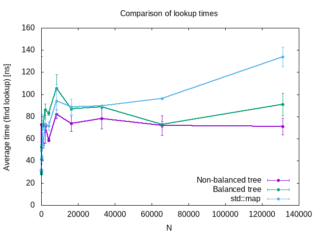

# Teruzzi - Advanced Programming Exam

In this folder you can find the following files:

- `bst.hh`, the header file containing definitions and declarations of the classes used
- `main.cc`, the file where the tests are run
- `Makefile` to compile
- `plot_scripts.sh` and `plot.gnu`, a bash and a gnuplot script to make the plot for the performances
- `treeperformances.png`, the plot with the times for the find lookup for the tree (non balanced and balanced) and for the map.

To compile the source code type the make command. To execute, the instruction is the following:

`./main.x N`

where `N` will be the number of nodes, both in the tree and in the map.

The tree chosen are templated with integers (both for key and value), and the same random numbers are inserted in the tree and in std::map. The code prints out the times for the search of 11 numbers in the tree, in the std::map, and in the balanced tree.

The bash script `plot_scripts.sh` performs the execution and the statistical analysis for some values of `N`. 

The presence of no memory leaks has been assured running the following command:

`valgrind --leak-check=full --show-leak-kinds=all ./main.x N`

## Implementation

The tree  implemented in a class called `bst`, which owns an object of type `C` to compare the key values, called `cmp`, a `std::unique_ptr` to the head of the tree, called `root`. The implementation of the `struct node` has been made private of the `class bst`.

The nodes have been implemented with an `std::pair p` storing the key and the value, a `std::unique_ptr left ` pointing to the left child (if any), a `std::unique_ptr right` pointing to the right child (if any), and a raw pointer to node,  `node* parent`, storing the address of the parent node. For the `root` , where no parent is present, the parent is set to `nullptr`.

All the methods requested have been implemented.

##### Benchmark

In the following the result for the test of the performances:

The non-balanced and balanced tree perform quite similar in the case of a tree with random integers. It is highly probable that, for the majority of the key searched, they cannot be found in the tree and the search mush traverse the whole tree. 

std::map performs worse than the tree for large number of nodes.

I expect, regarding the logarithmic behavior, a quite constant behavior for large number of nodes, which I can appreciate for the tree in the plot above.

